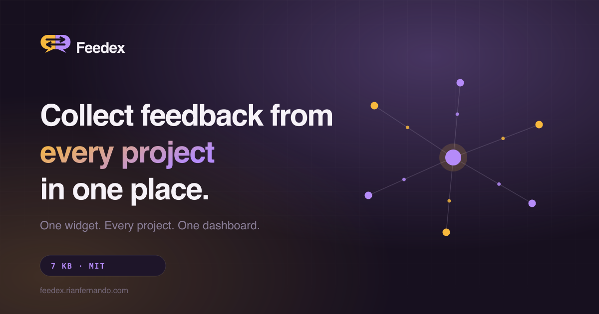
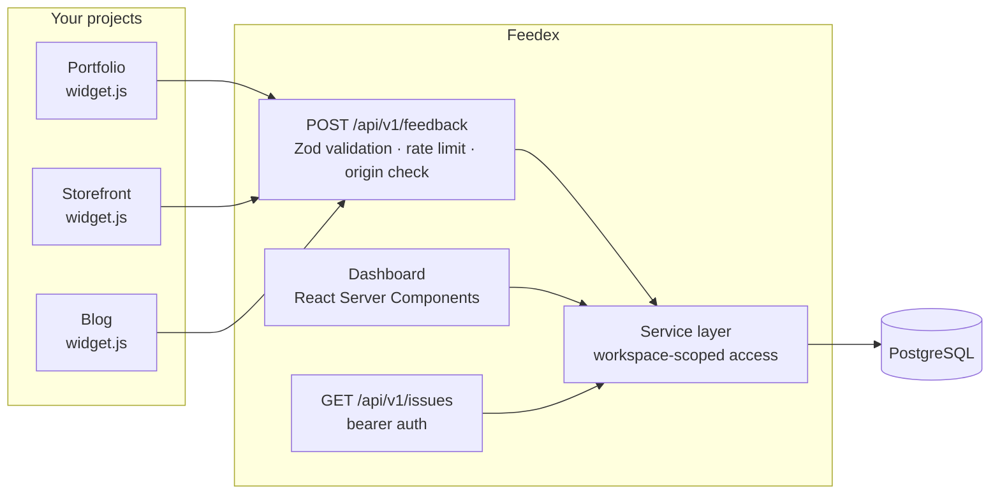

# Feedex — Developer Feedback Platform

[](https://github.com/Rian-Fernando/Feedex/actions/workflows/ci.yml)
[](https://github.com/Rian-Fernando/Feedex/actions/workflows/codeql.yml)
[](LICENSE)
[](docs/WIDGET.md)
[](https://feedex.rianfernando.com)

Collect feedback from every project in one place. Drop a single script tag into
any web app, and the bugs, feature requests, and UI issues your users report land
in one dashboard — with the page, browser, operating system, and viewport already
attached.

**Live:** [feedex.rianfernando.com](https://feedex.rianfernando.com)



## Why it's different

Most feedback tools assume you have one product. A developer with a portfolio, a
storefront, a blog, and two side projects ends up with a different inbox per site,
or no inbox at all.

Feedex inverts that. Every project gets its own widget, its own keys, and its own
feedback stream — and all of them roll up into a single workspace you actually
check. The widget is 7 kB gzipped with no dependencies, renders inside a shadow
root so it cannot touch or be touched by your page's CSS, and attaches the
technical context automatically. The reporter types one thing; you get everything
you would otherwise have to ask for.

The architecture is multi-tenant from the first commit. Workspaces own projects,
projects own feedback, and every read is workspace-scoped in the service layer —
not by convention in the UI. Adding team members later is a feature, not a
rewrite.

## Architecture



Full notes in [docs/ARCHITECTURE.md](docs/ARCHITECTURE.md).

## What the dashboard does

- **Overview** — project count, open issues, resolved count, total reports, a
  14-day volume trend, a category breakdown, recent feedback, and an activity
  timeline.
- **Projects** — create a project, get its widget snippet and keys, configure the
  widget's copy, colour, position, theme, and categories.
- **Feedback** — filter by project, status, category, and priority; search across
  titles, descriptions, and reporter emails. Filters live in the URL, so a view is
  shareable and survives a reload.
- **Detail** — full captured context, internal team-only notes, and two-click
  triage across status, priority, and category.
- **Keys** — a public key for the browser and a secret key for servers. Secrets
  are stored only as HMAC digests and shown exactly once. Both rotate in place.
- **Settings** — profile, password, appearance, workspace defaults, members, and
  the danger zone.
- **Sign-in** — email and password, plus Google and GitHub when configured.

## Install the widget

One tag. No build step, no package, no framework requirement.

```html
<script
  src="https://feedex.rianfernando.com/widget.js"
  data-feedex-key="pk_fdx_your_project_key"
  defer
></script>
```

It can also be driven programmatically:

```js
Feedex.open('bug');
Feedex.identify({ email: 'user@example.com' });
Feedex.setMetadata({ plan: 'pro', build: 'a1b2c3d' });
```

Full options in [docs/WIDGET.md](docs/WIDGET.md).

## What it captures

Automatically, with every report:

| Field               | Example                       |
| ------------------- | ----------------------------- |
| Page URL and path   | `https://example.com/reports` |
| Browser and version | `Chrome 131.0.6778`           |
| Operating system    | `macOS 15.2`                  |
| Device class        | `desktop`                     |
| Viewport            | `1512 × 858`                  |
| Screen              | `1512 × 982`                  |
| Language            | `en-US`                       |
| Time zone           | `America/New_York`            |
| Referrer            | `https://example.com/`        |

No cookies are read, no storage is written, and no fingerprint is computed. Email
is collected only if the reporter chooses to provide it.

## Run it

Local development needs no database. With `DATABASE_URL` unset, Feedex runs an
embedded PGlite instance — PostgreSQL compiled to WebAssembly — under `.data/`,
and applies migrations on first access.

```bash
git clone https://github.com/Rian-Fernando/Feedex.git
cd Feedex
npm install
npm run db:seed      # optional: demo workspace with realistic data
npm run dev
```

Open [localhost:3000](http://localhost:3000). The seed prints a demo account you
can sign in with.

For production, set `DATABASE_URL` to a real PostgreSQL instance and run
`npm run db:migrate`. See [docs/DEPLOYMENT.md](docs/DEPLOYMENT.md).

### Scripts

| Command                | What it does                                    |
| ---------------------- | ----------------------------------------------- |
| `npm run dev`          | Build the widget, then start the dev server     |
| `npm run build`        | Production build                                |
| `npm run verify`       | Format check, lint, typecheck, unit tests       |
| `npm test`             | Unit tests (Vitest)                             |
| `npm run test:e2e`     | Browser smoke test against a running dev server |
| `npm run db:generate`  | Generate SQL migrations from the schema         |
| `npm run db:migrate`   | Apply pending migrations                        |
| `npm run db:seed`      | Seed a demo workspace                           |
| `npm run db:reset`     | Delete the local PGlite database                |
| `npm run widget:build` | Bundle the widget to `public/widget.js`         |
| `npm run og:generate`  | Regenerate the OG card and favicons             |

## Tech stack

| Layer          | Choice                                 | Why                                                                                                                 |
| -------------- | -------------------------------------- | ------------------------------------------------------------------------------------------------------------------- |
| Framework      | Next.js 16, App Router                 | Server Components keep data access on the server; one project covers the marketing site, the dashboard, and the API |
| Language       | TypeScript, strict                     | `noUncheckedIndexedAccess` included                                                                                 |
| Database       | PostgreSQL via Drizzle ORM             | Typed SQL, plain-SQL migrations in the repo, no codegen step                                                        |
| Local database | PGlite                                 | Same dialect and same migrations with nothing to install                                                            |
| Styling        | Tailwind CSS v4                        | CSS-first config; every value is an OKLCH design token                                                              |
| UI primitives  | Radix UI                               | Focus management and ARIA that is genuinely hard to get right by hand                                               |
| Animation      | Motion, Three.js via React Three Fiber | Scroll reveals and one restrained hero scene                                                                        |
| Auth           | Custom: scrypt + opaque DB sessions    | No beta dependency; the `accounts` table is already shaped for OAuth                                                |
| Validation     | Zod                                    | One schema per contract, shared by actions, the API, and the widget                                                 |
| Widget build   | esbuild                                | Bundled independently of the app, so nothing from the dashboard can leak in                                         |

## Security

- Passwords: scrypt (N=2^16, r=8, p=1), per-password salt, parameters stored in
  the hash so they can be raised later.
- OAuth: Google and GitHub, both optional. State cookies on every flow, PKCE
  where the provider supports it, and account linking only on a provider-verified
  email — so registering elsewhere with someone's address cannot take over their
  workspace.
- Sessions: 256-bit opaque tokens in `httpOnly`, `SameSite=Lax` cookies; only the
  SHA-256 is stored, so a database snapshot cannot be replayed as a login.
- Secret API keys: stored as HMAC digests keyed by `AUTH_SECRET`.
- Ingestion: Zod-validated and bounded, rate limited per IP and per project in
  Postgres (so the limit holds across instances), with an origin check against the
  project's declared domain.
- Sign-in: rate limited per IP; identical response and equivalent timing for an
  unknown email and a wrong password.
- Every workspace-scoped query filters on `workspace_id` in the service layer.

Report a vulnerability via [SECURITY.md](SECURITY.md).

## Project structure

```
src/
├── app/
│   ├── (marketing)/          landing page
│   ├── (auth)/               sign in, register
│   ├── (dashboard)/          authenticated app
│   ├── api/                  ingestion, REST API, health
│   ├── llms.txt/             GEO manifest
│   ├── robots.ts             AI + search crawler policy
│   └── sitemap.ts
├── components/
│   ├── ui/                   design system primitives
│   ├── marketing/            hero, product tour, sections
│   ├── dashboard/            shell, tables, forms, panels
│   ├── brand/                logo and mark
│   └── three/                hero WebGL scene
├── lib/
│   ├── auth/                 sessions, password hashing, API keys
│   ├── db/                   schema and driver selection
│   ├── validation.ts         every input contract
│   ├── taxonomy.ts           categories, statuses, priorities
│   └── rate-limit.ts
├── server/
│   ├── actions/              server actions (mutations)
│   └── services/             domain layer, workspace-scoped
├── config/                   env contract and site metadata
└── styles/                   design tokens
widget/src/                   embeddable widget (no deps)
drizzle/                      SQL migrations
scripts/                      build, seed, migrate, smoke test
docs/                         architecture, API, widget, deployment
```

## Documentation

| Document                                | Contents                                                               |
| --------------------------------------- | ---------------------------------------------------------------------- |
| [ARCHITECTURE.md](docs/ARCHITECTURE.md) | Data model, tenancy, request paths, the decisions and their trade-offs |
| [API.md](docs/API.md)                   | REST reference, auth, errors, rate limits                              |
| [WIDGET.md](docs/WIDGET.md)             | Install, configure, and drive the widget                               |
| [DEPLOYMENT.md](docs/DEPLOYMENT.md)     | Vercel, Postgres, Cloudflare DNS, Search Console                       |
| [ROADMAP.md](docs/ROADMAP.md)           | What is next and why it is not here yet                                |

## Roadmap

Deliberately not in this version: AI categorisation, duplicate detection, GitHub
and Linear sync, Slack and Discord delivery, webhooks, screenshot capture, session
replay, feature voting, and team invitations. The schema already carries roles and
permissions; the rest is [ROADMAP.md](docs/ROADMAP.md).

## License

MIT — see [LICENSE](LICENSE).

## About

Feedex is designed and built by [Rian Fernando](https://rianfernando.com). It is
one product in a portfolio of independently deployed applications listed at
[rianfernando.com/projects](https://rianfernando.com/projects).
